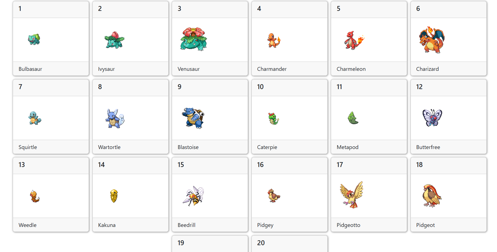

## PokeApiLuisAngelPonce

### This project is developed with html, css, bootstrap, javascript, react

### Description

It is a website developed in vite react using the pokeapi api to practice how to manipulate the api

### Thumbnail

[Visit me](https://pokeapiluisangelponce.netlify.app/)
