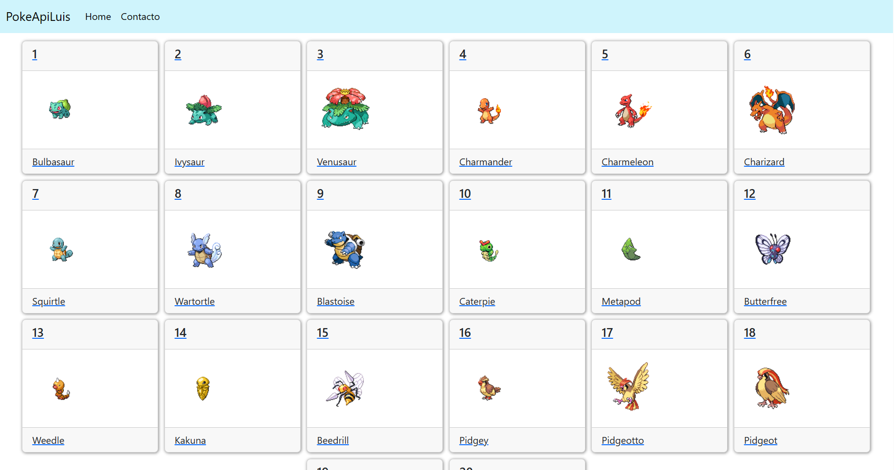

## PokeApiLuisAngelPonce

### Este proyecto esta desarrollado con html, css, bootstrap, javascript, react

### Descripción

es un sitio web desarrollado en vite react utilizando la api de pokeapi para practicar como manipulara la api

### Miniatura

[Visitame](https://pokeapiluisangelponce.netlify.app/)
